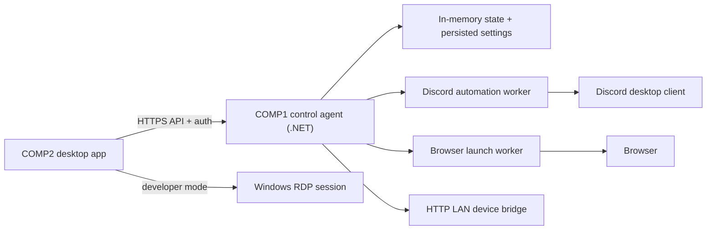

# Architecture

## Overview

The system is split into a Windows appliance on `COMP1` and a desktop controller on `COMP2`.

## Components

### `apps/comp2-desktop/`

Electron shell for the operator console. It handles:

- login to the `COMP1` agent
- health and stream status polling
- sending browser URL and Discord target selections
- starting and stopping the stream workflow
- launching developer-mode RDP

### `services/comp1-agent/`

Minimal API service hosted on `COMP1`. It is the trusted orchestration layer that:

- authenticates local controller sessions
- exposes health and current-state endpoints
- launches Discord and browser tasks
- starts and stops the stream automation flow
- surfaces trace logs and automation failures
- launches or advertises developer-mode remote access

### `services/comp1-automation/`

Automation-specific logic is intentionally isolated here. This assembly contains:

- browser launch helpers
- Discord process launch logic
- orchestration for join-call and begin-stream flows
- trace collection for retries and debugging

Actual UI selectors and window-discovery work will need validation on the real target device, but the interfaces and orchestration flow are already separated from the HTTP layer.

### `packages/shared-contracts/`

Shared TypeScript types for request payloads, device state, and stream presets used by the Electron app.

## Trust Boundaries

- `COMP2` is trusted only after successful login.
- `COMP1` accepts LAN API requests authenticated by username/password and bearer token.
- Discord account state is intentionally kept on `COMP1` and is never managed directly from `COMP2`.
- Remote desktop is separate from the control API so the API never becomes a proxy for arbitrary desktop input.

## Authentication Model

The v1 flow is intentionally simple:

1. Operator enters a username and password in the `COMP2` app.
2. `COMP1` validates the credentials against local configuration.
3. `COMP1` issues a short-lived bearer token.
4. The Electron app stores the token in memory and sends it on future API calls.

This design leaves room for a future upgrade to device pairing or rotating secrets without changing the desktop UX much.

## State Model

The `COMP1` agent maintains a runtime state object with:

- health status
- current URL
- whether Discord is running
- whether the browser is running
- whether a stream is active
- current selected stream target
- most recent error
- recent automation trace entries

## Recovery Model

The appliance should auto-recover after reboot or power loss:

- agent starts automatically on boot
- the machine returns to a controllable login-ready state
- preferred browser and developer-mode settings persist
- retries are scoped to launch and workflow steps, not arbitrary desktop control

## Implementation Priorities

1. Build the LAN API and state model.
2. Build the desktop controller against that contract.
3. Validate browser launch and Discord startup.
4. Prove the end-to-end automation slice.
5. Add RDP workflow and recovery automation.
